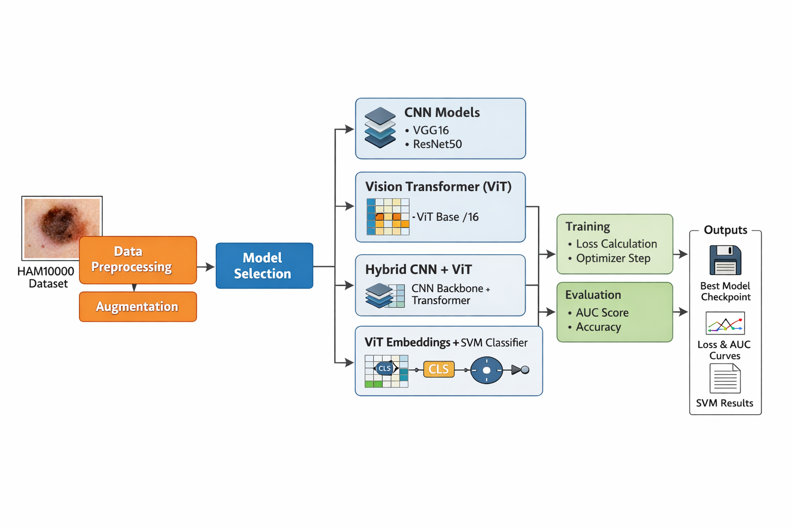

# Skin Lesion Classification on HAM10000  
## CNNs · Vision Transformers · Hybrid CNN–ViT · ViT + SVM




This project presents a **comprehensive and reproducible experimental framework** for **skin lesion classification** using the **HAM10000 dataset**.  
It provides a **fair comparison** between **CNN-based models**, **Vision Transformers (ViT)**, **hybrid CNN–Transformer architectures**, and **ViT representations combined with classical SVM classifiers**, all evaluated under **identical conditions**.

The framework is designed for **research, academic reports, and master-level theses**, emphasizing **rigor, reproducibility, and clear experimental analysis**.

---

## 📌 Objectives

- Compare **CNNs vs Vision Transformers** on a medical imaging task  
- Study **pretraining vs training from scratch**  
- Explore **hybrid CNN + ViT architectures**  
- Evaluate **ViT representation quality** using an SVM classifier  
- Analyze performance using **Loss and AUC curves**  
- Build a **reusable experimental pipeline** for fair benchmarking  

---

## 🧠 Big Picture: What the System Does

The project acts as a **unified experimentation framework**:

- Load and split HAM10000 (60% train / 40% validation)
- Apply standardized preprocessing and augmentation
- Train a selected model (CNN / ViT / Hybrid)
- Evaluate **Loss** and **AUC** at every epoch
- Save:
  - best model checkpoint
  - training history
  - loss and AUC curves
- Separately:
  - extract ViT embeddings
  - train and evaluate an **SVM classifier**

This ensures **consistent conditions across all experiments**, enabling meaningful comparisons.

---

## 🏗️ System Architecture (Conceptual)

```

Dataset (HAM10000)
│
▼
Preprocessing & Augmentation
│
▼
Model Selection
(CNN / ViT / Hybrid)
│
▼
Training Loop (AMP + Optimizer)
│
▼
Validation (Loss + AUC)
│
▼
Outputs
(Checkpoints, History, Curves)

```

A **parallel pipeline** extracts ViT embeddings and feeds them into an **SVM classifier**.

---

## 📂 Project Structure

```bash
project/
│
├── config.py                 # Global configuration and hyperparameters
├── datasets.py               # Dataset loading, preprocessing, augmentation
├── train.py                  # Main training and evaluation pipeline
│
├── resnet.py                 # ResNet50 fine-tuning
├── vgg16.py                  # VGG16 fine-tuning
├── models_vit.py             # ViT Base/16 (scratch and fine-tune)
├── hybrid_cnn_vit.py         # Hybrid CNN + Transformer model
│
├── vit_svm.py                # ViT embeddings + SVM classifier
│
├── labels.csv                # Image names and class labels
├── images/                   # HAM10000 images
│
└── outputs/
    ├── checkpoint_*.pth      # Best model checkpoints
    ├── history_*.pt          # Training history (loss & AUC)
    ├── loss_*.png            # Loss curves
    └── auc_*.png             # AUC curves
```

---

## 🔄 End-to-End Data Flow

### Deep Learning Training Pipeline

1. `train.py` parses CLI arguments (`--model`, `--num_classes`, etc.)
2. Batch size is selected automatically:

   * **CNN models** → `BATCH_SIZE_CNN`
   * **ViT / Hybrid models** → `BATCH_SIZE_VIT`
3. `datasets.py`:

   * loads `labels.csv`
   * performs a **stratified 60/40 split**
   * applies preprocessing and augmentation
   * builds PyTorch DataLoaders
4. The selected model is built:

   * `vgg16.py`, `resnet.py`, `models_vit.py`, or `hybrid_cnn_vit.py`
5. Training loop:

   * forward pass
   * loss computation
   * backward pass + optimizer step (AMP enabled)
   * probability collection for AUC
6. Validation loop:

   * forward pass only
   * loss and AUC computation
7. Outputs are saved:

   * best checkpoint (based on validation AUC)
   * training history
   * loss and AUC curves

---

### ViT Embeddings + SVM Pipeline

1. `vit_svm.py` loads a **ViT backbone without a classifier head**
2. CLS embeddings are extracted for all images
3. Embeddings are standardized
4. An SVM (linear or RBF kernel) is trained
5. Performance is evaluated using **Accuracy** and **Macro AUC**
6. Results are saved to text files

---

## 📊 Dataset: HAM10000

**HAM10000 (Human Against Machine with 10,000 images)** is a dermoscopic dataset with **7 skin lesion classes**.

### Dataset Configuration

* Image size: **224 × 224**
* Split: **60% training / 40% validation**
* Stratified split to preserve class distribution

### CSV Format

```csv
image,label
ISIC_0024306.jpg,0
ISIC_0024307.jpg,1
...
```

---

## 🔄 Preprocessing & Augmentation

### Normalization

All images are normalized using **ImageNet statistics**:

* Mean: `[0.485, 0.456, 0.406]`
* Std:  `[0.229, 0.224, 0.225]`

### Training Augmentation

Applied only on training data:

* Random horizontal flip
* Random vertical flip
* Random rotation (±15°)
* Color jitter (brightness, contrast, saturation)

**Goal:** reduce overfitting and improve generalization.

### Validation

* Resize to 224×224
* Normalization only (no augmentation)

---

## 🧠 Models Implemented

### 1️⃣ VGG16 (CNN)

* ImageNet pretrained
* Fine-tuning strategies:

  * classifier only
  * last convolution block
  * full model

📄 File: `vgg16.py`

---

### 2️⃣ ResNet50 (CNN)

* ImageNet pretrained
* Residual connections for stable training
* Strong CNN baseline for medical images

📄 File: `resnet.py`

---

### 3️⃣ Vision Transformer – ViT Base/16

Two configurations:

* **Training from scratch**
* **ImageNet pretrained + fine-tuning**

Key details:

* Patch size: **16×16**
* CLS token for classification
* Global self-attention

📄 File: `models_vit.py`

---

### 4️⃣ Hybrid CNN + ViT

Architecture:

1. CNN backbone extracts feature map `[B, 2048, 7, 7]`
2. Each spatial cell becomes a **1×1 token**
3. Tokens are projected to transformer dimension
4. CLS token + positional embeddings are added
5. Transformer encoder processes tokens
6. CLS output is classified

This combines:

* **local feature extraction (CNN)**
* **global reasoning (Transformer)**

📄 File: `hybrid_cnn_vit.py`

---

### 5️⃣ ViT Embeddings + SVM

Pipeline:

1. ViT backbone without classification head
2. Extract CLS embeddings (768-D)
3. Standardize features
4. Train SVM (linear or RBF)
5. Evaluate Accuracy and Macro AUC

📄 File: `vit_svm.py`

---

## ⚙️ Training Configuration

* Optimizer: **AdamW**
* Loss: **CrossEntropyLoss**
* Weight decay: `1e-4`
* Automatic Mixed Precision (AMP) enabled

### Model-Specific Batch Sizes

| Model Type            | Batch Size |
| --------------------- | ---------- |
| CNN (VGG16, ResNet50) | 16–32      |
| ViT / Hybrid          | 4          |

**Reason:** ViT self-attention is memory intensive; AMP and smaller batches are required for limited VRAM.

---

## 📈 Evaluation Metrics

Computed **per epoch**:

* **Loss**
* **AUC (macro, one-vs-rest)**

Saved outputs:

* Loss curves (`loss_*.png`)
* AUC curves (`auc_*.png`)
* Best model checkpoint (by validation AUC)

---

## 🚀 Running Experiments

### CNNs

```bash
python train.py --model vgg16 --num_classes 7
python train.py --model resnet50 --num_classes 7
```

### Vision Transformers

```bash
python train.py --model vit_scratch --num_classes 7
python train.py --model vit_finetune --num_classes 7
```

### Hybrid CNN + ViT

```bash
python train.py --model hybrid --num_classes 7
```

### ViT + SVM

```bash
python vit_svm.py --num_classes 7 --pretrained --kernel linear
python vit_svm.py --num_classes 7 --pretrained --kernel rbf --C 3.0
```

---

## 📊 Experimental Results (Best Validation AUC)

| Model                    | Validation AUC |
| ------------------------ | -------------- |
| **ResNet50 (fine-tune)** | **0.916**      |
| VGG16 (fine-tune)        | 0.912          |
| ViT Base/16 (fine-tune)  | 0.851          |
| ViT + SVM (linear)       | 0.880          |
| Hybrid CNN + ViT         | 0.760          |
| ViT Base/16 (scratch)    | 0.755          |

---

## 🔬 Key Observations

* CNNs outperform ViT on limited medical data
* ViT benefits strongly from ImageNet pretraining
* ViT embeddings are highly informative (strong SVM performance)
* Hybrid CNN–ViT models are sensitive to design and hyperparameters
* Training ViT from scratch is not suitable for small datasets

---

## 🧠 Scientific Conclusions

* **Inductive bias** in CNNs is crucial for medical images
* **Transformers require large-scale data or strong pretraining**
* Hybrid architectures are promising but complex
* Representation learning (ViT + SVM) is a strong alternative to end-to-end training

---

## 🔮 Future Work

* Class imbalance handling (weighted loss, focal loss)
* Explainability (Grad-CAM, attention rollout)
* Multi-scale Transformers
* Self-supervised pretraining
* External test-set validation

---

## ✍️ Author

Soufiane JADDA
Developed as part of an **academic / master-level study**
